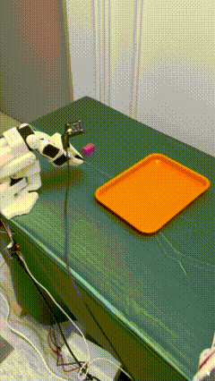
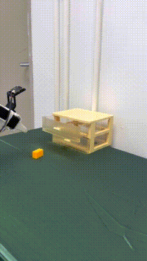

## Empirical Evaluation of Lightweight Vision-Language-Action Models: Generalization and Robustness in SmolVLA

<table>
  <tr>
    <td></td>
    <td></td>
  </tr>
</table>

### Install Lerobot

1. Install Miniconda For Ubuntu 22.04

```cmd
mkdir -p ~/miniconda3
cd miniconda3
wget https://repo.anaconda.com/miniconda/Miniconda3-latest-Linux-x86_64.sh -O ~/miniconda3/miniconda.sh
bash ~/miniconda3/miniconda.sh -b -u -p ~/miniconda3
rm ~/miniconda3/miniconda.sh
source ~/miniconda3/bin/activate
conda init --all
```

​	2.Create and activate a fresh conda environment for lerobot
```cmd
conda create -y -n lerobot python=3.10 && conda activate lerobot
```

​	3.Clone
```cmd
git clone https://github.com/ianzhaoyh/lerobot.git
```

​	4.When using miniconda, install ffmpeg in your environment

```cmd
conda install ffmpeg=7.1.1 -c conda-forge
```

​	5.Install LeRobot with dependencies for the feetech motors

```cmd
cd ~/lerobot && pip install -e ".[feetech]"
```

​	6.Check Pytorch and Torchvision

```cmd
import torch
print(torch.cuda.is_available())
```

### Configure the motors

Find USB ports associated to your arms To find the correct ports for each arm, run the utility script twice:
```cmd
lerobot-find-port
```

Example output:
```cmd
Finding all available ports for the MotorBus.
['/dev/ttyACM0', '/dev/ttyACM1']
Remove the usb cable from your MotorsBus and press Enter when done.

[...Disconnect corresponding leader or follower arm and press Enter...]

The port of this MotorsBus is /dev/ttyACM1
Reconnect the USB cable.
```

You might need to give access to the USB ports by running:
```cmd
sudo chmod 666 /dev/ttyACM0
sudo chmod 666 /dev/ttyACM1
```

Connect the usb cable from your computer and the power supply to the follower arm’s controller board. Then, run the following command.
```cmd
lerobot-setup-motors \
    --robot.type=so101_follower \
    --robot.port=/dev/ttyACM0  # <- paste here the port found at previous step
```

You should  see the following instructions 
```cmd
Connect the controller board to the 'gripper' motor only and press enter.
```

As instructed, plug the gripper’s motor. Make sure it’s the only motor connected to the board, and that the motor itself is not yet daisy-chained to any other motor. As you press [Enter], the script will automatically set the id and baudrate for that motor.

You should then see the following message:
```cmd
'gripper' motor id set to 6
```

Followed by the next instruction:
```cmd
Connect the controller board to the 'wrist_roll' motor only and press enter.
```

When you are done, the script will simply finish, at which point the motors are ready to be used. You can now plug the 3-pin cable from each motor to the next one, and the cable from the first motor (the ‘shoulder pan’ with id=1) to the controller board, which can now be attached to the base of the arm.
Do the same steps for the leader arm.

```cmd
lerobot-setup-motors \
    --teleop.type=so101_leader \
    --teleop.port=/dev/ttyACM0  # <- paste here the port found at previous step
```

### Teleoperate

**Simple teleop** Then you are ready to teleoperate your robot! Run this simple script (it won't connect and display the cameras):

Note that the id associated with a robot is used to store the calibration file. It’s important to use the same id when teleoperating, recording, and evaluating when using the same setup.
```cmd
sudo chmod 666 /dev/ttyACM*

lerobot-teleoperate \
    --robot.type=so101_follower \
    --robot.port=/dev/ttyACM0 \
    --robot.id=my_awesome_follower_arm \
    --teleop.type=so101_leader \
    --teleop.port=/dev/ttyACM1 \
    --teleop.id=my_awesome_leader_arm
```

### Add Cameras

To instantiate a camera, you need a camera identifier. This identifier might change if you reboot your computer or re-plug your camera, a behavior mostly dependant on your operating system.

To find the camera indices of the cameras plugged into your system, run the following script:
```cmd
lerobot-find-cameras opencv # or realsense for Intel Realsense cameras
```

The terminal will print out the following information.
```cmd
--- Detected Cameras ---
Camera #0:
  Name: OpenCV Camera @ 0
  Type: OpenCV
  Id: 0
  Backend api: AVFOUNDATION
  Default stream profile:
    Format: 16.0
    Width: 1920
    Height: 1080
    Fps: 15.0
--------------------
(more cameras ...)
```

If you have more cameras, you can change `--robot.cameras` to add cameras. You should note the format of the index_or_path, which is determined by the last digit of the camera ID output by `python -m lerobot.find_cameras opencv`.
For example, you want to add a side camera:

```cmd
lerobot-teleoperate \
    --robot.type=so101_follower \
    --robot.port=/dev/ttyACM0 \
    --robot.id=my_awesome_follower_arm \
    --robot.cameras="{ front: {type: opencv, index_or_path: 0, width: 640, height: 480, fps: 30"}, side: {type: opencv, index_or_path: 2, width: 640, height: 480, fps: 30}}" \
    --teleop.type=so101_leader \
    --teleop.port=/dev/ttyACM1 \
    --teleop.id=my_awesome_leader_arm \
    --display_data=true
```

### Record the dataset

```cmd
lerobot-record \
    --robot.type=so101_follower \
    --robot.port=/dev/ttyACM0 \
    --robot.id=my_awesome_follower_arm \
    --robot.cameras="{ front: {type: opencv, index_or_path: 0, width: 640, height: 480, fps: 30, fourcc: "MJPG"}, side: {type: opencv, index_or_path: 2, width: 640, height: 480, fps: 30, fourcc: "MJPG"}}" \
    --teleop.type=so101_leader \
    --teleop.port=/dev/ttyACM1 \
    --teleop.id=my_awesome_leader_arm \
    --display_data=true \
    --dataset.repo_id=MUST/test \
    --dataset.num_episodes=5 \
    --dataset.single_task="Grab the black cube" \
    --dataset.push_to_hub=false \
    --dataset.episode_time_s=30 \
    --dataset.reset_time_s=30 
```

Record function
The **record** function provides a suite of tools for capturing and managing data during robot operation.

1.Data Stroage

* Data is stored using the `LeRobotDataset` format and is stored on disk during recording.
* By default, the dataset is pushed to your Hugging Face page after recording.
* To disable uploading, use: `--dataset.push_to_hub=False`

2.Checkpoint

* Checkpoints are automatically created during recording.
* To resume after an interruption, re-run the same command with: `--resume=true`

3.Recording Parameters
--dataset.episode_time_s : Duration per data episode (seconds)
--dataset.reset_time_s: Environment reset time after each episode (seconds)
--dataset.num_episodes：Total episodes to record

4.Keyboard Controls During Recording
→ (Right Arrow): Early-stop current episode/reset; move to next.
← (Left Arrow): Cancel current episode; re-record it.
ESC: Stop session immediately, encode videos, and upload dataset.

## Train and Evaluate SmolVLA

**Set Up Your Environment**
Install SmolVLA dependencies by running:

```cmd
pip install -e ".[smolvla]"
```

**Finetune SmolVLA on your data**
Use [smolvla_base](https://hf.co/lerobot/smolvla_base), our pretrained 450M model, and fine-tune it on your data

```cmd
lerobot-train \
  --policy.path=lerobot/smolvla_base \
  --dataset.repo_id=${HF_USER}/mydataset \
  --batch_size=64 \
  --steps=20000 \
  --output_dir=outputs/train/my_smolvla \
  --job_name=my_smolvla_training \
  --policy.device=cuda \
  --wandb.enable=true
```

**Evaluate the finetuned model and run it in real-time**

```cmd
lerobot-record \
  --robot.type=so101_follower \
  --robot.port=/dev/ttyACM0 \ # <- Use your port
  --robot.id=my_blue_follower_arm \ # <- Use your robot id
  --robot.cameras="{ front: {type: opencv, index_or_path: 8, width: 640, height: 480, fps: 30, fourcc: "MJPG"}}" \ # <- Use your cameras
  --dataset.single_task="Grasp a lego block and put it in the bin." \ # <- Use the same task description you used in your dataset recording
  --dataset.repo_id=${HF_USER}/eval_DATASET_NAME_test \  # <- This will be the dataset name on HF Hub
  --dataset.episode_time_s=50 \
  --dataset.num_episodes=10 \
  # <- Teleop optional if you want to teleoperate in between episodes \
  # --teleop.type=so100_leader \
  # --teleop.port=/dev/ttyACM0 \
  # --teleop.id=my_red_leader_arm \
  --policy.path=HF_USER/FINETUNE_MODEL_NAME # <- Use your fine-tuned model
```
